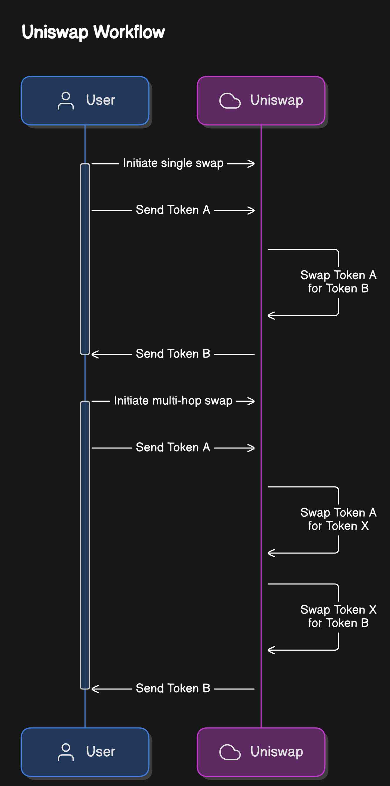

## About
This project implements both single swap and multi-hop swap functionalities using Uniswap on the Sepolia Ethereum test network. It provides detailed information about various liquidity pools involved in the swap processes, including DAI, USDC, and WETH pools with different fee structures. The single swap flow allows users to directly exchange one token for another, while the multi-hop swap flow facilitates complex trades by routing through multiple token pairs.
### Swap Routes
- **DAI -> USDC -> WETH**
- **DAI <-> USDC | USDC <-> WETH**

### Pool Details

#### 3000 Fee
- **weth_usdc pool** (Sepolia ETH): `0x9799b5EDC1aA7D3FAd350309B08df3F64914E244`
- **usdc_dai pool** (Sepolia ETH): `0x4B615e16dFa475e7fC516D920b941B60B977Be8b`

#### 500 Fee
- **weth_usdc pool** (Sepolia ETH): `0xbA57Efa18073647E5269DB04Ff70B8e26Fd0BEaF`
- **usdc_dai pool** (Sepolia ETH): `0xb67391331625BD0BE95e6898CAE52070D953Ae1F`
- **link_weth pool** (Sepolia ETH): `0x9BB3Ea0b68491F2a0cf2776C850cbB566022B345`

#### Icon Credits
- [Icon by Dixit Lakhani](https://www.freepik.com/search)
- [Icon by Freepik](https://www.freepik.com/search)